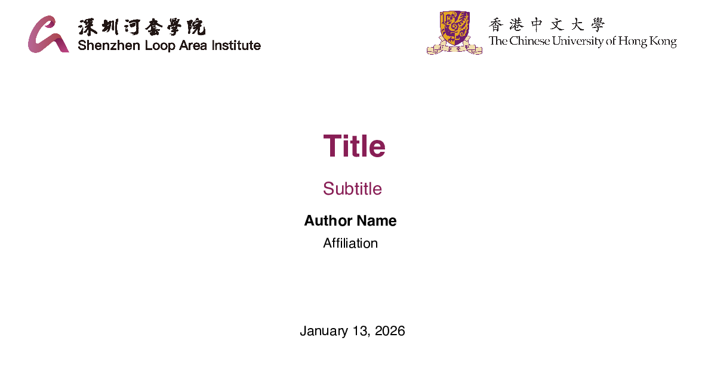
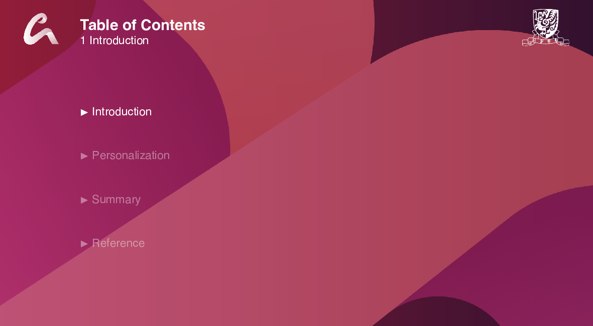
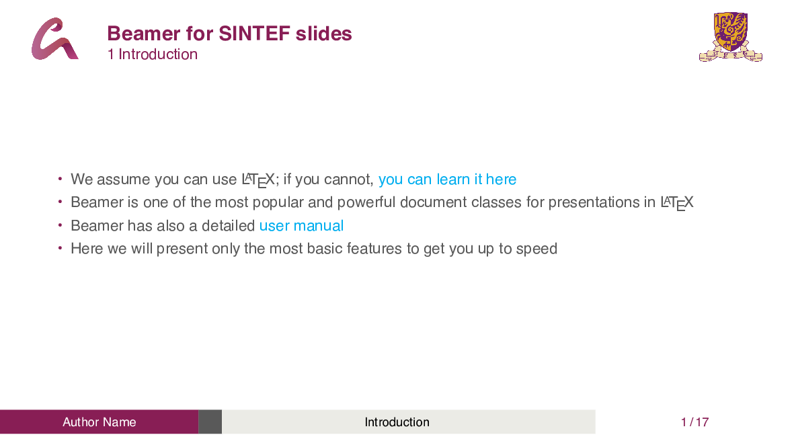
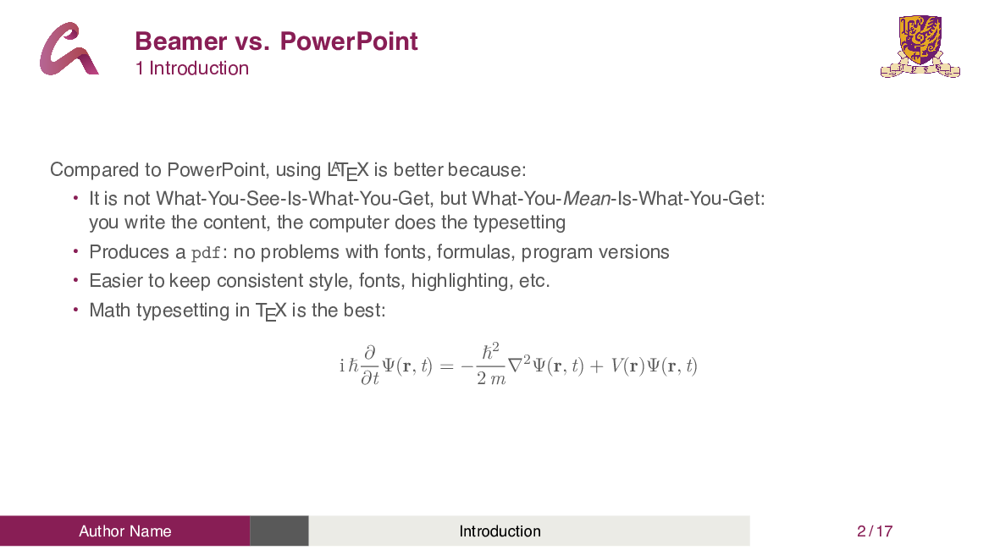
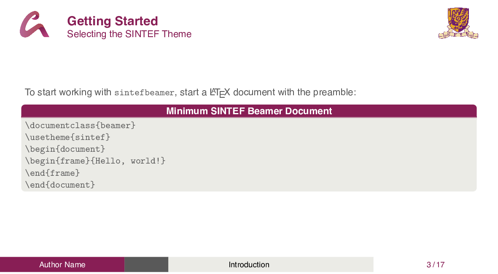
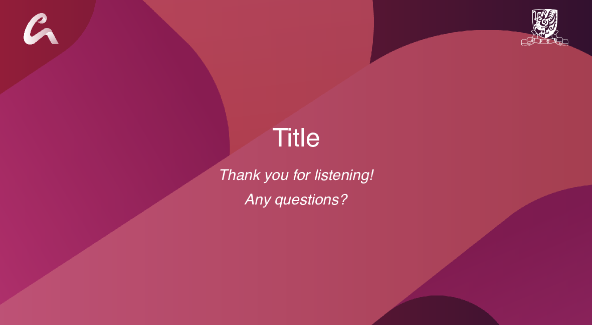

# SLAI Beamer Template

A LaTeX Beamer theme for academic presentations

*The Chinese University of Hong Kong (CUHK) & Shenzhen Loop Area Institute (SLAI)*

---

## Screenshots

| Title Page | Table of Contents | Content Page |
|:---:|:---:|:---:|
|  |  |  |

| Beamer vs. PowerPoint | Getting Started | Backmatter |
|:---:|:---:|:---:|
|  |  |  |

---

## Features

- **16:9 Aspect Ratio** — Modern widescreen format
- **SLAI Purple Theme** — Primary color `#881E55`
- **Progress Bar Footline** — Visual progress indicator with section name
- **Auto Table of Contents** — Generated at each section start
- **Special Slide Types** — Chapter slides, side-picture slides, backmatter
- **Chinese Support** — XeLaTeX with xeCJK integration

---

## Quick Start

```latex
\documentclass{beamer}
\usetheme{cuhkslai}

\title{Your Title}
\subtitle{Your Subtitle}
\author{Your Name}
\affiliation{Your Affiliation}
\date{\today}

\begin{document}
\maketitle
\resetpagenumber

\section{Introduction}
\begin{frame}{Frame Title}
  Your content here.
\end{frame}

\backmatter
\end{document}
```

---

## Commands

### Title Page

| Command | Description |
|:--------|:------------|
| `\title{...}` | Presentation title |
| `\subtitle{...}` | Presentation subtitle |
| `\author{...}` | Author name |
| `\affiliation{...}` | Author affiliation |
| `\date{...}` | Date |
| `\course{...}` | Course name *(optional)* |
| `\IDnumber{...}` | Student ID *(optional)* |
| `\supervisor{...}` | Supervisor name *(optional)* |

### Special Slides

| Command | Description |
|:--------|:------------|
| `\maketitle` | Generate title page |
| `\resetpagenumber` | Reset page number to 1 |
| `\chapterslide{Title}{Content}` | Chapter title slide with background |
| `\sidepicslide{Image}{Title}{Content}` | Slide with side picture |
| `\backmatter` | Ending "Thank you" slide |
| `\backmatter[notitle]` | Ending slide without title |

---

## Colors

The color palette is generated using [ColorSpace](https://mycolor.space/?hex=%23881E55&sub=1) based on the primary **SLAI Purple** `#881E55`.

**Primary:** `maincolor` 

**Warm Gradient:**

| `warmcolor1` | `warmcolor2` | `warmcolor3` | `warmcolor4` | `warmcolor5` |
|:---:|:---:|:---:|:---:|:---:|
|  |  |  |  |  |

**Cool Gradient:**

| `coolcolor1` | `coolcolor2` | `coolcolor3` | `coolcolor4` | `coolcolor5` |
|:---:|:---:|:---:|:---:|:---:|
|  |  |  |  |  |

---

## Requirements

- **Compiler:** XeLaTeX
- **Packages:** beamer, tikz, etoolbox, fontspec, xcolor, graphicx

---

## Overleaf

> Template link coming soon

---

## License

[GNU General Public License v3.0](LICENSE)

---

## Credits

- Based on [CUHK Beamer Template](https://www.overleaf.com/latex/templates/xiang-gang-zhong-wen-da-xue-zhong-wen-mo-ban-cuhk-beamer-template/bpgghjpjkqxw) by Yiwen Bao
- Author: CHEN Pengan — The Chinese University of Hong Kong & Shenzhen Loop AI Institute

